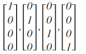

神经网络：表述(Neural Networks: Representation)
-----------------------------------------------------

### 1.1 非线性假设

我们之前学的，无论是线性回归还是逻辑回归都有这样一个缺点，即：当特征太多时，计算的负荷会非常大。

下面是一个例子：

当我们使用$x_1$, $x_2$ 的多次项式进行预测时，我们可以应用的很好。
之前我们已经看到过，使用非线性的多项式项，能够帮助我们建立更好的分类模型。假设我们有非常多的特征，例如大于100个变量，我们希望用这100个特征来构建一个非线性的多项式模型，结果将是数量非常惊人的特征组合，即便我们只采用两两特征的组合$(x_1x_2+x_1x_3+x_1x_4+...+x_2x_3+x_2x_4+...+x_{99}x_{100})$，我们也会有接近5000个组合而成的特征。这对于一般的逻辑回归来说需要计算的特征太多了。

假设我们希望训练一个模型来识别视觉对象（例如识别一张图片上是否是一辆汽车），我们怎样才能这么做呢？一种方法是我们利用很多汽车的图片和很多非汽车的图片，然后利用这些图片上一个个像素的值（饱和度或亮度）来作为特征。

假如我们只选用灰度图片，每个像素则只有一个值（而非 **RGB**值），我们可以选取图片上的两个不同位置上的两个像素，然后训练一个逻辑回归算法利用这两个像素的值来判断图片上是否是汽车：

假使我们采用的都是50x50像素的小图片，并且我们将所有的像素视为特征，则会有 2500个特征，如果我们要进一步将两两特征组合构成一个多项式模型，则会有约${{2500}^{2}}/2$个（接近3百万个）特征。普通的逻辑回归模型，不能有效地处理这么多的特征，这时候我们需要神经网络。

### 1.2 神经元和大脑

### 1.3 模型表示1

为了构建神经网络模型，我们需要首先思考大脑中的神经网络是怎样的？每一个神经元都可以被认为是一个处理单元/神经核（**processing unit**/**Nucleus**），它含有许多输入/树突（**input**/**Dendrite**），并且有一个输出/轴突（**output**/**Axon**）。神经网络是大量神经元相互链接并通过电脉冲来交流的一个网络。

神经网络模型建立在很多神经元之上，每一个神经元又是一个个**学习模型**。这些神经元（也叫激活单元，**activation unit**）采纳一些特征作为输出，并且根据本身的模型提供一个输出。下图是一个以逻辑回归模型作为自身学习模型的神经元示例，在神经网络中，参数又可被成为权重（**weight**）。

我们设计出了类似于神经元的神经网络，效果如下：

其中$x_1$, $x_2$, $x_3$是输入单元（**input units**），我们将原始数据输入给它们。
$a_1$, $a_2$, $a_3$是中间单元，它们负责将数据进行处理，然后呈递到下一层。
最后是输出单元，它负责计算${h_\theta}\left( x \right)$。

神经网络模型是许多逻辑单元按照不同层级组织起来的网络，每一层的输出变量都是下一层的输入变量。下图为一个3层的神经网络，第一层成为输入层（**Input Layer**），最后一层称为输出层（**Output Layer**），中间一层成为隐藏层（**Hidden Layers**）。我们为每一层都增加一个偏差单位（**bias unit**）：

符号标记：
$a_{i}^{\left( j \right)}$ 代表第$j$ 层的第 $i$ 个激活单元。${{\theta }^{\left( j \right)}}$代表从第 $j$ 层映射到第$ j+1$ 层时的权重的矩阵，例如${{\theta }^{\left( 1 \right)}}$代表从第一层映射到第二层的权重的矩阵。其尺寸为：以第 $j+1$层的激活单元数量为行数，以第 $j$ 层的激活单元数加一为列数的矩阵。例如：上图所示的神经网络中${{\theta }^{\left( 1 \right)}}$的尺寸为 3*4。

对于上图所示的模型，激活单元和输出分别表达为：

$a_{1}^{(2)}=g(\Theta _{10}^{(1)}{{x}_{0}}+\Theta _{11}^{(1)}{{x}_{1}}+\Theta _{12}^{(1)}{{x}_{2}}+\Theta _{13}^{(1)}{{x}_{3}})$
$a_{2}^{(2)}=g(\Theta _{20}^{(1)}{{x}_{0}}+\Theta _{21}^{(1)}{{x}_{1}}+\Theta _{22}^{(1)}{{x}_{2}}+\Theta _{23}^{(1)}{{x}_{3}})$
$a_{3}^{(2)}=g(\Theta _{30}^{(1)}{{x}_{0}}+\Theta _{31}^{(1)}{{x}_{1}}+\Theta _{32}^{(1)}{{x}_{2}}+\Theta _{33}^{(1)}{{x}_{3}})$
${{h}_{\Theta }}(x)=g(\Theta _{10}^{(2)}a_{0}^{(2)}+\Theta _{11}^{(2)}a_{1}^{(2)}+\Theta _{12}^{(2)}a_{2}^{(2)}+\Theta _{13}^{(2)}a_{3}^{(2)})$

上面进行的讨论中只是将特征矩阵中的一行（一个训练实例）喂给了神经网络，我们需要将整个训练集都喂给我们的神经网络算法来学习模型。

我们可以知道：每一个$a$都是由上一层所有的$x$和每一个$x$所对应的权重决定的。

（我们把这样从左到右的算法称为前向传播算法( **FORWARD PROPAGATION** )）

把$x$, $\theta$, $a$ 分别用矩阵表示：

我们可以得到$\theta \cdot X=a$ 。

### 1.4 模型表示2

相对于使用循环来编码，利用向量化的方法会使得计算更为简便。以上面的神经网络为例，试着计算第二层的值：

我们令 ${{z}^{\left( 2 \right)}}={{\theta }^{\left( 1 \right)}}x$，则 ${{a}^{\left( 2 \right)}}=g({{z}^{\left( 2 \right)}})$ ，计算后添加 $a_{0}^{\left( 2 \right)}=1$。 计算输出的值为：

我们令 ${{z}^{\left( 3 \right)}}={{\theta }^{\left( 2 \right)}}{{a}^{\left( 2 \right)}}$，则 $h_\theta(x)={{a}^{\left( 3 \right)}}=g({{z}^{\left( 3 \right)}})$。
这只是针对训练集中一个训练实例所进行的计算。如果我们要对整个训练集进行计算，我们需要将训练集特征矩阵进行转置，使得同一个实例的特征都在同一列里。即：
${{z}^{\left( 2 \right)}}={{\Theta }^{\left( 1 \right)}}\times {{X}^{T}} $

 ${{a}^{\left( 2 \right)}}=g({{z}^{\left( 2 \right)}})$

为了更好了了解**Neuron Networks**的工作原理，我们先把左半部分遮住：

右半部分其实就是以$a_0, a_1, a_2, a_3$, 按照**Logistic Regression**的方式输出$h_\theta(x)$：

其实神经网络就像是**logistic regression**，只不过我们把**logistic regression**中的输入向量$\left[ x_1\sim {x_3} \right]$ 变成了中间层的$\left[ a_1^{(2)}\sim a_3^{(2)} \right]$, 即:  $h_\theta(x)=g\left( \Theta_0^{\left( 2 \right)}a_0^{\left( 2 \right)}+\Theta_1^{\left( 2 \right)}a_1^{\left( 2 \right)}+\Theta_{2}^{\left( 2 \right)}a_{2}^{\left( 2 \right)}+\Theta_{3}^{\left( 2 \right)}a_{3}^{\left( 2 \right)} \right)$ 
我们可以把$a_0, a_1, a_2, a_3$看成更为高级的特征值，也就是$x_0, x_1, x_2, x_3$的进化体，并且它们是由 $x$与$\theta$决定的，因为是梯度下降的，所以$a$是变化的，并且变得越来越厉害，所以这些更高级的特征值远比仅仅将 $x$次方厉害，也能更好的预测新数据。
这就是神经网络相比于逻辑回归和线性回归的优势。

### 1.5 特征和直观理解1

从本质上讲，神经网络能够通过学习得出其自身的一系列特征。在普通的逻辑回归中，我们被限制为使用数据中的原始特征$x_1,x_2,...,{{x}_{n}}$，我们虽然可以使用一些二项式项来组合这些特征，但是我们仍然受到这些原始特征的限制。在神经网络中，原始特征只是输入层，在我们上面三层的神经网络例子中，第三层也就是输出层做出的预测利用的是第二层的特征，而非输入层中的原始特征，我们可以认为第二层中的特征是神经网络通过学习后自己得出的一系列用于预测输出变量的新特征。

神经网络中，单层神经元（无中间层）的计算可用来表示逻辑运算，比如逻辑与(**AND**)、逻辑或(**OR**)。

举例说明：逻辑与(**AND**)；下图中左半部分是神经网络的设计与**output**层表达式，右边上部分是**sigmod**函数，下半部分是真值表。

我们可以用这样的一个神经网络表示**AND** 函数：

其中$\theta_0 = -30, \theta_1 = 20, \theta_2 = 20$
我们的输出函数$h_\theta(x)$即为：$h_\Theta(x)=g\left( -30+20x_1+20x_2 \right)$

我们知道$g(x)$的图像是：

所以我们有：$h_\Theta(x) \approx \text{x}_1 \text{AND} \, \text{x}_2$

所以我们的：$h_\Theta(x) $

这就是**AND**函数。

接下来再介绍一个**OR**函数：

**OR**与**AND**整体一样，区别只在于的取值不同。

### 1.6 样本和直观理解II

二元逻辑运算符（**BINARY LOGICAL OPERATORS**）当输入特征为布尔值（0或1）时，我们可以用一个单一的激活层可以作为二元逻辑运算符，为了表示不同的运算符，我们只需要选择不同的权重即可。

下图的神经元（三个权重分别为-30，20，20）可以被视为作用同于逻辑与（**AND**）：

下图的神经元（三个权重分别为-10，20，20）可以被视为作用等同于逻辑或（**OR**）：

下图的神经元（两个权重分别为 10，-20）可以被视为作用等同于逻辑非（**NOT**）：

我们可以利用神经元来组合成更为复杂的神经网络以实现更复杂的运算。例如我们要实现**XNOR** 功能（输入的两个值必须一样，均为1或均为0），即 $\text{XNOR}=( \text{x}_1\, \text{AND}\, \text{x}_2 )\, \text{OR} \left( \left( \text{NOT}\, \text{x}_1 \right) \text{AND} \left( \text{NOT}\, \text{x}_2 \right) \right)$
首先构造一个能表达$\left( \text{NOT}\, \text{x}_1 \right) \text{AND} \left( \text{NOT}\, \text{x}_2 \right)$部分的神经元：

然后将表示 **AND** 的神经元和表示$\left( \text{NOT}\, \text{x}_1 \right) \text{AND} \left( \text{NOT}\, \text{x}_2 \right)$的神经元以及表示 OR 的神经元进行组合：

我们就得到了一个能实现 $\text{XNOR}$ 运算符功能的神经网络。

按这种方法我们可以逐渐构造出越来越复杂的函数，也能得到更加厉害的特征值。

这就是神经网络的厉害之处。

### 1.7 多类分类

当我们有不止两种分类时（也就是$y=1,2,3….$），比如以下这种情况，该怎么办？如果我们要训练一个神经网络算法来识别路人、汽车、摩托车和卡车，在输出层我们应该有4个值。例如，第一个值为1或0用于预测是否是行人，第二个值用于判断是否为汽车。

输入向量$x$有三个维度，两个中间层，输出层4个神经元分别用来表示4类，也就是每一个数据在输出层都会出现${{\left[ a\text{ }b\text{ }c\text{ }d \right]}^{T}}$，且$a,b,c,d$中仅有一个为1，表示当前类。下面是该神经网络的可能结构示例：

神经网络算法的输出结果为四种可能情形之一：

二、神经网络的学习(Neural Networks: Learning)
---------------------------------------------

### 2.1 代价函数

首先引入一些便于稍后讨论的新标记方法：

假设神经网络的训练样本有$m$个，每个包含一组输入$x$和一组输出信号$y$，$L$表示神经网络层数，$S_I$表示每层的**neuron**个数($S_l$表示输出层神经元个数)，$S_L$代表最后一层中处理单元的个数。

将神经网络的分类定义为两种情况：二类分类和多类分类，

二类分类：$S_L=1, y=0\, or\, 1$表示哪一类；

$K$类分类：$S_L=k, y_i = 1$表示分到第$i$类；$(k>2)$

我们回顾逻辑回归问题中我们的代价函数为：

$  J\left(\theta \right)=-\frac{1}{m}\left[\sum_\limits{i=1}^{m}{y}^{(i)}\log{h_\theta({x}^{(i)})}+\left(1-{y}^{(i)}\right)log\left(1-h_\theta\left({x}^{(i)}\right)\right)\right]+\frac{\lambda}{2m}\sum_\limits{j=1}^{n}{\theta_j}^{2}  $

在逻辑回归中，我们只有一个输出变量，又称标量（**scalar**），也只有一个因变量$y$，但是在神经网络中，我们可以有很多输出变量，我们的$h_\theta(x)$是一个维度为$K$的向量，并且我们训练集中的因变量也是同样维度的一个向量，因此我们的代价函数会比逻辑回归更加复杂一些，为：$\newcommand{\subk}[1]{ #1_k }$
$$h_\theta\left(x\right)\in \mathbb{R}^{K}$$ $${\left({h_\theta}\left(x\right)\right)}_{i}={i}^{th} \text{output}$$

$J(\Theta) = -\frac{1}{m} \left[ \sum\limits_{i=1}^{m} \sum\limits_{k=1}^{k} {y_k}^{(i)} \log \subk{(h_\Theta(x^{(i)}))} + \left( 1 - y_k^{(i)} \right) \log \left( 1- \subk{\left( h_\Theta \left( x^{(i)} \right) \right)} \right) \right] + \frac{\lambda}{2m} \sum\limits_{l=1}^{L-1} \sum\limits_{i=1}^{s_l} \sum\limits_{j=1}^{s_{l+1}} \left( \Theta_{ji}^{(l)} \right)^2$

这个看起来复杂很多的代价函数背后的思想还是一样的，我们希望通过代价函数来观察算法预测的结果与真实情况的误差有多大，唯一不同的是，对于每一行特征，我们都会给出$K$个预测，基本上我们可以利用循环，对每一行特征都预测$K$个不同结果，然后在利用循环在$K$个预测中选择可能性最高的一个，将其与$y$中的实际数据进行比较。

正则化的那一项只是排除了每一层$\theta_0$后，每一层的$\theta$ 矩阵的和。最里层的循环$j$循环所有的行（由$s_{l+1}$  层的激活单元数决定），循环$i$则循环所有的列，由该层（$s_l$层）的激活单元数所决定。即：$h_\theta(x)$与真实值之间的距离为每个样本-每个类输出的加和，对参数进行**regularization**的处理除去**bias**项所有参数的平方和。

### 2.2 反向传播算法

之前我们在计算神经网络预测结果的时候我们采用了一种正向传播方法，我们从第一层开始正向一层一层进行计算，直到最后一层的$h_{\theta}\left(x\right)$。

现在，为了计算代价函数的偏导数$\frac{\partial}{\partial\Theta^{(l)}_{ij}}J\left(\Theta\right)$，我们需要采用一种反向传播算法，也就是首先计算最后一层的误差，然后再一层一层反向求出各层的误差，直到倒数第二层。
以一个例子来说明反向传播算法。

假设我们的训练集只有一个样本$\left({x}^{(1)},{y}^{(1)}\right)$，我们的神经网络是一个四层的神经网络，其中$K=4，S_{L}=4，L=4$：

前向传播算法：

我们从最后一层的误差开始计算，误差是激活单元的预测（${a^{(4)}}$）与实际值（$y^k$）之间的误差，（$k=1:k$）。
我们用$\delta$来表示误差，则：$\delta^{(4)}=a^{(4)}-y$
我们利用这个误差值来计算前一层的误差：$\delta^{(3)}=\left({\Theta^{(3)}}\right)^{T}\delta^{(4)}\ast g'\left(z^{(3)}\right)$
其中 $g'(z^{(3)})$是 $S$ 形函数的导数，$g'(z^{(3)})=a^{(3)}\ast(1-a^{(3)})$。而$(θ^{(3)})^{T}\delta^{(4)}$则是权重导致的误差的和。下一步是继续计算第二层的误差：
$ \delta^{(2)}=(\Theta^{(2)})^{T}\delta^{(3)}\ast g'(z^{(2)})$
因为第一层是输入变量，不存在误差。我们有了所有的误差的表达式后，便可以计算代价函数的偏导数了，假设$λ=0$，即我们不做任何正则化处理时有：
$\frac{\partial}{\partial\Theta_{ij}^{(l)}}J(\Theta)=a_{j}^{(l)} \delta_{i}^{l+1}$

重要的是清楚地知道上面式子中上下标的含义：

$l$ 代表目前所计算的是第几层。

$j$ 代表目前计算层中的激活单元的下标，也将是下一层的第$j$个输入变量的下标。

$i$ 代表下一层中误差单元的下标，是受到权重矩阵中第$i$行影响的下一层中的误差单元的下标。

如果我们考虑正则化处理，并且我们的训练集是一个特征矩阵而非向量。在上面的特殊情况中，我们需要计算每一层的误差单元来计算代价函数的偏导数。在更为一般的情况中，我们同样需要计算每一层的误差单元，但是我们需要为整个训练集计算误差单元，此时的误差单元也是一个矩阵，我们用$\Delta^{(l)}_{ij}$来表示这个误差矩阵。第 $l$  层的第 $i$ 个激活单元受到第 $j$ 个参数影响而导致的误差。

我们的算法表示为：

即首先用正向传播方法计算出每一层的激活单元，利用训练集的结果与神经网络预测的结果求出最后一层的误差，然后利用该误差运用反向传播法计算出直至第二层的所有误差。

在求出了$\Delta_{ij}^{(l)}$之后，我们便可以计算代价函数的偏导数了，计算方法如下：
$ D_{ij}^{(l)} :=\frac{1}{m}\Delta_{ij}^{(l)}+\lambda\Theta_{ij}^{(l)}$              ${if}\; j \neq  0$

$ D_{ij}^{(l)} :=\frac{1}{m}\Delta_{ij}^{(l)}$                             ${if}\; j = 0$

### 2.3 反向传播算法的直观理解

前向传播算法：

反向传播算法做的是：

**感悟**：上图中的 $\delta^{(l)}_{j}="error" \ of cost \  for \ a^{(l)}_{j} \ (unit \ j \ in \ layer \ l)$ 理解如下：

$\delta^{(l)}_{j}$ 相当于是第 $l$ 层的第 $j$ 单元中得到的激活项的“误差”，即”正确“的 $a^{(l)}_{j}$ 与计算得到的 $a^{(l)}_{j}$ 的差。

而 $a^{(l)}_{j}=g(z^{(l)})$ ，（g为sigmoid函数）。我们可以想象 $\delta^{(l)}_{j}$ 为函数求导时迈出的那一丁点微分

### 2.4 实现注意：展开参数

把你的参数从矩阵展开成向量

### 2.5 梯度检验

当我们对一个较为复杂的模型（例如神经网络）使用梯度下降算法时，可能会存在一些不容易察觉的错误，意味着，虽然代价看上去在不断减小，但最终的结果可能并不是最优解。

为了避免这样的问题，我们采取一种叫做梯度的数值检验（**Numerical Gradient Checking**）方法。这种方法的思想是通过估计梯度值来检验我们计算的导数值是否真的是我们要求的。

对梯度的估计采用的方法是在代价函数上沿着切线的方向选择离两个非常近的点然后计算两个点的平均值用以估计梯度。即对于某个特定的 $\theta$，我们计算出在 $\theta$-$\varepsilon $ 处和 $\theta$+$\varepsilon $ 的代价值（$\varepsilon $是一个非常小的值，通常选取 0.001），然后求两个代价的平均，用以估计在 $\theta$ 处的代价值。

当$\theta$是一个向量时，我们则需要对偏导数进行检验。因为代价函数的偏导数检验只针对一个参数的改变进行检验，下面是一个只针对$\theta_1$进行检验的示例：
$$ \frac{\partial}{\partial\theta_1}=\frac{J\left(\theta_1+\varepsilon_1,\theta_2,\theta_3...\theta_n \right)-J \left( \theta_1-\varepsilon_1,\theta_2,\theta_3...\theta_n \right)}{2\varepsilon} $$

最后我们还需要对通过反向传播方法计算出的偏导数进行检验。

根据上面的算法，计算出的偏导数存储在矩阵 $D_{ij}^{(l)}$ 中。检验时，我们要将该矩阵展开成为向量，同时我们也将 $\theta$ 矩阵展开为向量，我们针对每一个 $\theta$ 都计算一个近似的梯度值，将这些值存储于一个近似梯度矩阵中，最终将得出的这个矩阵同 $D_{ij}^{(l)}$ 进行比较。

### 2.6 随机初始化

任何优化算法都需要一些初始的参数。到目前为止我们都是初始所有参数为0，这样的初始方法对于逻辑回归来说是可行的，但是对于神经网络来说是不可行的。如果我们令所有的初始参数都为0，这将意味着我们第二层的所有激活单元都会有相同的值。同理，如果我们初始所有的参数都为一个非0的数，结果也是一样的。

我们通常初始参数为正负ε之间的随机值，假设我们要随机初始一个尺寸为10×11的参数矩阵，代码如下：

`Theta1 = rand(10, 11) * (2*eps) – eps`

### 2.7 综合起来

小结一下使用神经网络时的步骤：

网络结构：第一件要做的事是选择网络结构，即决定选择多少层以及决定每层分别有多少个单元。

第一层的单元数即我们训练集的特征数量。

最后一层的单元数是我们训练集的结果的类的数量。

如果隐藏层数大于1，确保每个隐藏层的单元个数相同，通常情况下隐藏层单元的个数越多越好。

我们真正要决定的是隐藏层的层数和每个中间层的单元数。

训练神经网络：

1. 参数的随机初始化

2. 利用正向传播方法计算所有的$h_{\theta}(x)$

3. 编写计算代价函数 $J$ 的代码

4. 利用反向传播方法计算所有偏导数

5. 利用数值检验方法检验这些偏导数

6. 使用优化算法来最小化代价函数

三、支持向量机(Support Vector Machines)
-----------------------------------------

### 3.1 优化目标

从逻辑回归开始展示我们如何一点一点修改来得到本质上的支持向量机

那么，在逻辑回归中我们已经熟悉了这里的假设函数形式，和右边的S型激励函数。然而，为了解释一些数学知识.我将用$z$ 表示$\theta^Tx$。

现在考虑下我们想要逻辑回归做什么：如果有一个 $y=1$的样本，我的意思是不管是在训练集中或是在测试集中，又或者在交叉验证集中，总之是 $y=1$，现在我们希望${{h}_{\theta }}\left( x \right)$ 趋近1。因为我们想要正确地将此样本分类，这就意味着当 ${{h}_{\theta }}\left( x \right)$趋近于1时，$\theta^Tx$ 应当远大于0相反地，如果我们有另一个样本，即$y=0$。我们希望假设函数的输出值将趋近于0，这对应于$\theta^Tx$，或者就是 $z$ 会远小于0，因为对应的假设函数的输出值趋近0。

现在，先忽略 $1/m$ 这一项

现在，一起来考虑两种情况：

一种是$y$等于1的情况；另一种是 $y$ 等于0的情况。

在第一种情况中，假设 $y=1$ ，此时在目标函数中只需有第一项起作用，因为$y=1$时，$(1-y)$项将等于0。因此，当在 $y=1$ 的样本中时，即在 $(x, y) $中 ，我们得到 $y=1$ $-\log(1-\frac{1}{1+e^{-z}})$这样一项，这里同上一张幻灯片一致。

我用 $z$ 表示$\theta^Tx$，即： $z= \theta^Tx$。当然，在代价函数中，$y$ 前面有负号。我们只是这样表示，如果 $y=1$ 代价函数中，这一项也等于1。这样做是为了简化此处的表达式。如果画出关于$z$ 的函数，你会看到左下角的这条曲线，我们同样可以看到，当$z$ 增大时，也就是相当于$\theta^Tx$增大时，$z$ 对应的值会变的非常小。对整个代价函数而言，影响也非常小。这也就解释了，为什么逻辑回归在观察到正样本$y=1$时，试图将$\theta^Tx$设置得非常大。因为，在代价函数中的这一项会变的非常小。

现在开始建立支持向量机，我们从这里开始：

我们会从这个代价函数开始，也就是$-\log(1-\frac{1}{1+e^{-z}})$一点一点修改，让我取这里的$z=1$ 点，我先画出将要用的代价函数。

新的代价函，是在$y=1$的前提下的。

目前，我们只是讨论了$y=1$的情况，另外一种情况是当$y=0$时，此时如果你仔细观察代价函数只留下了第二项，因为第一项被消除了。如果当$y=0$时，那么这一项也就是0了。所以上述表达式只留下了第二项。因此，这个样本的代价或是代价函数的贡献。将会由这一项表示。并且，如果你将这一项作为$z$的函数，那么，这里就会得到横轴$z$。现在，你完成了支持向量机中的部分内容，同样地，我们要替代这一条蓝色的线，用相似的方法。

如果我们用一个新的代价函数来代替，即这条从0点开始的水平直线，然后是一条斜线，像上图。那么，现在让我给这两个方程命名，左边的函数，我称之为${\cos}t_1{(z)}$，同时，右边函数我称它为${\cos}t_0{(z)}$。这里的下标是指在代价函数中，对应的 $y=1$ 和 $y=0$ 的情况，拥有了这些定义后，现在，我们就开始构建支持向量机。

这是我们在逻辑回归中使用代价函数$J(\theta)$。也许这个方程看起来不是非常熟悉。这是因为之前有个负号在方程外面，但是，这里我所做的是，将负号移到了表达式的里面，这样做使得方程看起来有些不同。对于支持向量机而言，实质上我们要将这替换为${\cos}t_1{(z)}$，也就是${\cos}t_1{(\theta^Tx)}$，同样地，我也将这一项替换为${\cos}t_0{(z)}$，也就是代价${\cos}t_0{(\theta^Tx)}$。这里的代价函数${\cos}t_1$，就是之前所提到的那条线。此外，代价函数${\cos}t_0$，也是上面所介绍过的那条线。因此，对于支持向量机，我们得到了这里的最小化问题，即:

然后，再加上正则化参数。现在，按照支持向量机的惯例，事实上，我们的书写会稍微有些不同，代价函数的参数表示也会稍微有些不同。

首先，我们要除去$1/m$这一项，当然，这仅仅是由于人们使用支持向量机时，对比于逻辑回归而言，不同的习惯所致，但这里我所说的意思是：你知道，我将要做的是仅仅除去$1/m$这一项，但是，这也会得出同样的 ${{\theta }}$ 最优值，好的，因为$1/m$ 仅是个常量，因此，你知道在这个最小化问题中，无论前面是否有$1/m$ 这一项，最终我所得到的最优值${{\theta }}$都是一样的。这里我的意思是，先给你举一个样本，假定有一最小化问题：即要求当$(u-5)^2+1$取得最小值时的$u$值，这时最小值为：当$u=5$时取得最小值。

现在，如果我们想要将这个目标函数乘上常数10，这里我的最小化问题就变成了：求使得$10×(u-5)^2+10$最小的值$u$，然而，使得这里最小的$u$值仍为5。因此将一些常数乘以你的最小化项，这并不会改变最小化该方程时得到$u$值。因此，这里我所做的是删去常量$m$。也相同的，我将目标函数乘上一个常量$m$，并不会改变取得最小值时的${{\theta }}$值。

第二点概念上的变化，我们只是指在使用支持向量机时，一些如下的标准惯例，而不是逻辑回归。因此，对于逻辑回归，在目标函数中，我们有两项：第一个是训练样本的代价，第二个是我们的正则化项，我们不得不去用这一项来平衡。这就相当于我们想要最小化$A$加上正则化参数$\lambda$，然后乘以其他项$B$对吧？这里的$A$表示这里的第一项，同时我用**B**表示第二项，但不包括$\lambda$，我们不是优化这里的$A+\lambda\times B$。我们所做的是通过设置不同正则参数$\lambda$达到优化目的。这样，我们就能够权衡对应的项，是使得训练样本拟合的更好。即最小化$A$。还是保证正则参数足够小，也即是对于**B**项而言，但对于支持向量机，按照惯例，我们将使用一个不同的参数替换这里使用的$\lambda$来权衡这两项。你知道，就是第一项和第二项我们依照惯例使用一个不同的参数称为$C$，同时改为优化目标，$C×A+B$。
因此，在逻辑回归中，如果给定$\lambda$，一个非常大的值，意味着给予$B$更大的权重。而这里，就对应于将$C$ 设定为非常小的值，那么，相应的将会给$B$比给$A$更大的权重。因此，这只是一种不同的方式来控制这种权衡或者一种不同的方法，即用参数来决定是更关心第一项的优化，还是更关心第二项的优化。当然你也可以把这里的参数$C$ 考虑成$1/\lambda$，同 $1/\lambda$所扮演的角色相同，并且这两个方程或这两个表达式并不相同，因为$C=1/\lambda$，但是也并不全是这样，如果当$C=1/\lambda$时，这两个优化目标应当得到相同的值，相同的最优值 ${{\theta }}$。因此，就用它们来代替。那么，我现在删掉这里的$\lambda$，并且用常数$C$来代替。因此，这就得到了在支持向量机中我们的整个优化目标函数。然后最小化这个目标函数，得到**SVM** 学习到的参数$C$。

最后有别于逻辑回归输出的概率。在这里，我们的代价函数，当最小化代价函数，获得参数${{\theta }}$时，支持向量机所做的是它来直接预测$y$的值等于1，还是等于0。因此，这个假设函数会预测1。当$\theta^Tx$大于或者等于0时，或者等于0时，所以学习参数${{\theta }}$就是支持向量机假设函数的形式。那么，这就是支持向量机数学上的定义。

### 3.2 大边界的直观理解

​                      *支持向量机模型的代价函数*

安全的间距因子：如果你有一个正样本，我们会希望$\theta^Tx>=1$，反之，如果$y=0$，我们观察一下，函数${\cos}t_0{(z)}$，它只有在$z<=-1$的区间里函数值为0。这是支持向量机的一个有趣性质。事实上，如果你有一个正样本$y=1$，则其实我们仅仅要求$\theta^Tx$大于等于0，就能将该样本恰当分出，这是因为如果$\theta^Tx$\>0大的话，我们的模型代价函数值为0，类似地，如果你有一个负样本，则仅需要$\theta^Tx$\<=0就会将负例正确分离，但是，支持向量机的要求更高，不仅仅要能正确分开输入的样本，即不仅仅要求$\theta^Tx$\>0，我们需要的是比0值大很多，比如大于等于1，我也想这个比0小很多，比如我希望它小于等于-1，这就相当于在支持向量机中嵌入了一个额外的安全因子，或者说安全的间距因子。

我们将这个常数$C$设置成一个非常大的值。比如我们假设$C$的值为100000或者其它非常大的数，然后来观察支持向量机会给出什么结果？

如果 $C$非常大，则最小化代价函数的时候，我们将会很希望找到一个使第一项为0的最优解。因此，让我们尝试在代价项的第一项为0的情形下理解该优化问题。比如我们可以把$C$设置成了非常大的常数，这将给我们一些关于支持向量机模型的直观感受。

$\min_\limits{\theta}C\sum_\limits{i=1}^{m}\left[y^{(i)}{\cos}t_{1}\left(\theta^{T}x^{(i)}\right)+\left(1-y^{(i)}\right){\cos}t\left(\theta^{T}x^{(i)}\right)\right]+\frac{1}{2}\sum_\limits{i=1}^{n}\theta^{2}_{j}$

假设：输入一个训练样本标签为$y=1$，你想令第一项为0，你需要做的是找到一个${{\theta }}$，使得$\theta^Tx>=1$，类似地，对于一个训练样本，标签为$y=0$，为了使${\cos}t_0{(z)}$ 函数的值为0，我们需要$\theta^Tx<=-1$

因此，现在考虑我们的优化问题。选择参数，使得第一项等于0，就会导致下面的优化问题，因为我们将选择参数使第一项为0，因此这个函数的第一项为0，因此是$C$乘以0加上二分之一乘以第二项。这里第一项是$C$乘以0，因此可以将其删去，因为我知道它是0。

这将遵从以下的约束：$\theta^Tx^{(i)}>=1$，如果 $y^{(i)}$是等于1 的，$\theta^Tx^{(i)}<=-1$，如果样本$i$是一个负样本，这样当你求解这个优化问题的时候，当你最小化这个关于变量${{\theta }}$的函数的时候，你会得到一个非常*有趣的决策边界*。

具体而言，如果你考察这样一个数据集，其中有正样本，也有负样本，可以看到这个数据集是线性可分的。

比如，这就是一个决策边界可以把正样本和负样本分开。但是多多少少这个看起来并不是非常自然是么?

或者我们可以画一条更差的决策界，这是另一条决策边界，可以将正样本和负样本分开，但仅仅是勉强分开，这些决策边界看起来都不是特别好的选择，支持向量机将会选择这个黑色的决策边界，相较于之前我用粉色或者绿色画的决策界。这条黑色的看起来好得多，黑线看起来是更稳健的决策界。在分离正样本和负样本上它显得的更好。数学上来讲，这是什么意思呢？这条黑线有更大的距离，这个距离叫做间距(**margin**)。

当画出这两条额外的蓝线，我们看到黑色的决策界和训练样本之间有更大的最短距离。然而粉线和蓝线离训练样本就非常近，在分离样本的时候就会比黑线表现差。因此，这个距离叫做支持向量机的间距，而这是支持向量机具有鲁棒性的原因，因为它努力用一个最大间距来分离样本。因此支持向量机有时被称为**大间距分类器**。

我将会从直观上略述为什么这个优化问题会产生大间距分类器。总之这个图示有助于你理解支持向量机模型的做法，即努力将正样本和负样本用最大的间距分开。

我们将这个大间距分类器中的正则化因子常数$C$设置的非常大，我记得我将其设置为了100000，因此对这样的一个数据集，也许我们将选择这样的决策界，从而最大间距地分离开正样本和负样本。那么在让代价函数最小化的过程中，我们希望找出在$y=1$和$y=0$两种情况下都使得代价函数中左边的这一项尽量为零的参数。如果我们找到了这样的参数，则我们的最小化问题便转变成：

事实上，支持向量机现在要比这个大间距分类器所体现得更成熟，尤其是当你使用大间距分类器的时候，你的学习算法会受异常点(outlier) 的影响。比如我们加入一个额外的正样本。

在这里，如果你加了这个样本，为了将样本用最大间距分开，也许我最终会得到一条类似这样的决策界，对么？就是这条粉色的线，仅仅基于一个异常值，仅仅基于一个样本，就将我的决策界从这条黑线变到这条粉线，这实在是不明智的。而如果正则化参数$C$，设置的非常大，这事实上正是支持向量机将会做的。它将决策界，从黑线变到了粉线，但是如果$C$ 设置的小一点，**如果你将C设置的不要太大，则你最终会得到这条黑线，**当然数据如果不是线性可分的，如果你在这里有一些正样本或者你在这里有一些负样本，则支持向量机也会将它们恰当分开。因此，大间距分类器的描述，仅仅是从直观上给出了正则化参数$C$非常大的情形，同时，要提醒你$C$的作用类似于$1/\lambda$，$\lambda$是我们之前使用过的正则化参数。这只是$C$非常大的情形，或者等价地 $\lambda$ 非常小的情形。你最终会得到类似粉线这样的决策界，但是实际上应用支持向量机的时候，**当$C$不是非常非常大的时候，它可以忽略掉一些异常点的影响，得到更好的决策界。**甚至当你的数据不是线性可分的时候，支持向量机也可以给出好的结果。

回顾 $C=1/\lambda$，因此：

$C$ 较大时，相当于 $\lambda$ 较小，可能会导致过拟合，高方差。

$C$ 较小时，相当于$\lambda$较大，可能会导致低拟合，高偏差。

我们稍后会介绍支持向量机的偏差和方差，希望在那时候关于如何处理参数的这种平衡会变得更加清晰。我希望，这节课给出了一些关于为什么支持向量机被看做大间距分类器的直观理解。它用最大间距将样本区分开，尽管从技术上讲，这只有当参数$C$是非常大的时候是真的，但是它对于理解支持向量机是有益的。

本节课中我们略去了一步，那就是我们在幻灯片中给出的优化问题。为什么会是这样的？它是如何得出大间距分类器的？我在本节中没有讲解，在下一节课中，我将略述这些问题背后的数学原理，来解释这个优化问题是如何得到一个大间距分类器的。

### 3.3 大边界分类背后的数学

在本节课中，我将介绍一些大间隔分类背后的数学原理。本节为选修部分，你完全可以跳过它，但是听听这节课可能让你对支持向量机中的优化问题，以及如何得到大间距分类器，产生更好的直观理解。

首先，让我来给大家复习一下关于向量内积的知识。假设我有两个向量，$u$和$v$，我将它们写在这里。两个都是二维向量，我们看一下，$u^T v$的结果。$u^T v$也叫做向量$u$和$v$之间的内积。由于是二维向量，我可以将它们画在这个图上。我们说，这就是向量$u$即在横轴上，取值为某个${{u}_{1}}$，而在纵轴上，高度是某个${{u}_{2}}$作为$u$的第二个分量。现在，很容易计算的一个量就是向量$u$的范数。$\left\| u \right\|$表示$u$的范数，即$u$的长度，即向量$u$的欧几里得长度。根据毕达哥拉斯定理，$\left\| u \right\|=\sqrt{u_{1}^{2}+u_{2}^{2}}$，这是向量$u$的长度，它是一个实数。现在你知道了这个的长度是多少了。我刚刚画的这个向量的长度就知道了。

现在让我们回头来看向量$v$ ，因为我们想计算内积。$v$是另一个向量，它的两个分量${{v}_{1}}$和${{v}_{2}}$是已知的。向量$v$可以画在这里，现在让我们来看看如何计算$u$和$v$之间的内积。这就是具体做法，我们将向量$v$投影到向量$u$上，我们做一个直角投影，或者说一个90度投影将其投影到$u$上，接下来我度量这条红线的长度。我称这条红线的长度为$p$，因此$p$就是长度，或者说是向量$v$投影到向量$u$上的量，我将它写下来，$p$是$v$投影到向量$u$上的长度，因此可以将${{u}^{T}}v=p\centerdot \left\| u \right\|$，或者说$u$的长度。这是计算内积的一种方法。如果你从几何上画出$p$的值，同时画出$u$的范数，你也会同样地计算出内积，答案是一样的。另一个计算公式是：$u^T v$就是$\left[ {{u}_{1}}\text{ }{{u}_{2}} \right]$ 这个一行两列的矩阵乘以$v$。因此可以得到${{u}_{1}}\times {{v}_{1}}+{{u}_{2}}\times {{v}_{2}}$。根据线性代数的知识，这两个公式会给出同样的结果。顺便说一句，$u^Tv=v^Tu$。因此如果你将$u$和$v$交换位置，将$u$投影到$v$上，而不是将$v$投影到$u$上，然后做同样地计算，只是把$u$和$v$的位置交换一下，你事实上可以得到同样的结果。申明一点，在这个等式中$u$的范数是一个实数，$p$也是一个实数，因此$u^T v$就是两个实数正常相乘。

最后一点，需要注意的就是$p$值，$p$事实上是有符号的，即它可能是正值，也可能是负值。我的意思是说，如果$u$是一个类似这样的向量，$v$是一个类似这样的向量，$u$和$v$之间的夹角大于90度，则如果将$v$投影到$u$上，会得到这样的一个投影，这是$p$的长度，在这个情形下我们仍然有${{u}^{T}}v$是等于$p$乘以$u$的范数。唯一一点不同的是$p$在这里是负的。在内积计算中，如果$u$和$v$之间的夹角小于90度，那么那条红线的长度$p$是正值。然而如果这个夹角大于90度，则$p$将会是负的。就是这个小线段的长度是负的。如果它们之间的夹角大于90度，两个向量之间的内积也是负的。这就是关于向量内积的知识。我们接下来将会使用这些关于向量内积的性质试图来理解支持向量机中的目标函数。

这就是我们先前给出的支持向量机模型中的目标函数。为了讲解方便，我做一点简化，仅仅是为了让目标函数更容易被分析。

我接下来忽略掉截距，令${{\theta }_{0}}=0$，这样更容易画示意图。我将特征数$n$置为2，因此我们仅有两个特征${{x}_{1}},{{x}_{2}}$，现在我们来看一下目标函数，支持向量机的优化目标函数。当我们仅有两个特征，即$n=2$时，这个式子可以写作：$\frac{1}{2}\left({\theta_1^2+\theta_2^2}\right)=\frac{1}{2}\left(\sqrt{\theta_1^2+\theta_2^2}\right)^2$，我们只有两个参数${{\theta }_{1}},{{\theta }_{2}}$。你可能注意到括号里面的这一项是向量${{\theta }}$的范数，或者说是向量${{\theta }}$的长度。我的意思是如果我们将向量${{\theta }}$写出来，那么我刚刚画红线的这一项就是向量${{\theta }}$的长度或范数。这里我们用的是之前学过的向量范数的定义，事实上这就等于向量${{\theta }}$的长度。

当然你可以将其写作${{\theta }_{0}}\text{,}{{\theta }_{1}},{{\theta }_{2}}$，如果${{\theta }_{0}}=0$，那就是${{\theta }_{1}},{{\theta }_{2}}$的长度。在这里我将忽略${{\theta }_{0}}$，这样来写$\theta$的范数，它仅仅和${{\theta }_{1}},{{\theta }_{2}}$有关。但是，数学上不管你是否包含，其实并没有差别，因此在我们接下来的推导中去掉${{\theta }_{0}}$不会有影响这意味着我们的目标函数是等于$\frac{1}{2}\left\| \theta \right\|^2$。因此支持向量机做的全部事情，就是**极小化参数向量**${{\theta }}$**范数的平方，或者说长度的平方**。

现在我将要看看这些项：$\theta^{T}x$更深入地理解它们的含义。给定参数向量$\theta $给定一个样本$x$，这等于什么呢?在前一页幻灯片上，我们画出了在不同情形下，$u^Tv$的示意图，我们将会使用这些概念，$\theta $和$x^{(i)}$就类似于$u$和$v$ 。

让我们看一下示意图：我们考察一个单一的训练样本，我有一个正样本在这里，用一个叉来表示这个样本$x^{(i)}$，意思是在水平轴上取值为$x_1^{(i)}$，在竖直轴上取值为$x_2^{(i)}$。这就是我画出的训练样本。尽管我没有将其真的看做向量。它事实上就是一个始于原点，终点位置在这个训练样本点的向量。现在，我们有一个参数向量我会将它也画成向量。我将$θ_1$画在横轴这里，将$θ_2$ 画在纵轴这里，那么内积$θ^T x^{(i)}$ 将会是什么呢？

使用我们之前的方法，我们计算的方式就是我将训练样本投影到参数向量${{\theta }}$，然后我来看一看这个线段的长度，我将它画成红色。我将它称为$p^{(i)}$用来表示这是第 $i$个训练样本在参数向量${{\theta }}$上的投影。根据我们之前幻灯片的内容，我们知道的是$θ^Tx^{(i)}$将会等于$p$ 乘以向量 $θ$ 的长度或范数。这就等于$\theta_1\cdot{x_1^{(i)}}+\theta_2\cdot{x_2^{(i)}}$。这两种方式是等价的，都可以用来计算$θ$和$x^{(i)}$之间的内积。

这告诉了我们什么呢？这里表达的意思是：这个$θ^Tx^{(i)}>=1$  或者$θ^Tx^{(i)}<-1$的,约束是可以被$p^{(i)}\cdot{x}>=1$这个约束所代替的。因为$θ^Tx^{(i)}=p^{(i)}\cdot{\left\| \theta \right\|}$ ，将其写入我们的优化目标。我们将会得到没有了约束，$θ^Tx^{(i)}$而变成了$p^{(i)}\cdot{\left\| \theta \right\|}$。

需要提醒一点，我们之前曾讲过这个优化目标函数可以被写成等于$\frac{1}{2}\left\| \theta \right\|^2$。

现在让我们考虑下面这里的训练样本。现在，继续使用之前的简化，即${{\theta }_{0}}=0$，我们来看一下支持向量机会选择什么样的决策界。这是一种选择，我们假设支持向量机会选择这个决策边界。这不是一个非常好的选择，因为它的间距很小。这个决策界离训练样本的距离很近。我们来看一下为什么支持向量机不会选择它。

对于这样选择的参数${{\theta }}$，可以看到参数向量${{\theta }}$事实上是和决策界是90度正交的，因此这个绿色的决策界对应着一个参数向量${{\theta }}$这个方向,顺便提一句${{\theta }_{0}}=0$的简化仅仅意味着决策界必须通过原点$(0,0)$。现在让我们看一下这对于优化目标函数意味着什么。

比如这个样本，我们假设它是我的第一个样本$x^{(1)}$，如果我考察这个样本到参数${{\theta }}$的投影，投影是这个短的红线段，就等于$p^{(1)}$，它非常短。类似地，这个样本如果它恰好是$x^{(2)}$，我的第二个训练样本，则它到${{\theta }}$的投影在这里。我将它画成粉色，这个短的粉色线段是$p^{(2)}$，即第二个样本到我的参数向量${{\theta }}$的投影。因此，这个投影非常短。$p^{(2)}$事实上是一个负值，$p^{(2)}$是在相反的方向，这个向量和参数向量${{\theta }}$的夹角大于90度，$p^{(2)}$的值小于0。

我们会发现这些$p^{(i)}$将会是非常小的数，因此当我们考察优化目标函数的时候，对于正样本而言，我们需要$p^{(i)}\cdot{\left\| \theta \right\|}>=1$,但是如果 $p^{(i)}$在这里非常小,那就意味着我们需要${{\theta }}$的范数非常大.因为如果 $p^{(1)}$ 很小,而我们希望$p^{(1)}\cdot{\left\| \theta \right\|}>=1$,令其实现的唯一的办法就是这两个数较大。如果 $p^{(1)}$ 小，我们就希望${{\theta }}$的范数大。类似地，对于负样本而言我们需要$p^{(2)}\cdot{\left\|\theta \right\|}<=-1$。我们已经在这个样本中看到$p^{(2)}$会是一个非常小的数，因此唯一的办法就是${{\theta }}$的范数变大。但是我们的目标函数是希望找到一个参数${{\theta }}$，它的范数是小的。因此，这看起来不像是一个好的参数向量${{\theta }}$的选择。

相反的，来看一个不同的决策边界。比如说，支持向量机选择了这个决策界，现在状况会有很大不同。如果这是决策界，这就是相对应的参数${{\theta }}$的方向，因此，在这个决策界之下，垂直线是决策界。使用线性代数的知识，可以说明，这个绿色的决策界有一个垂直于它的向量${{\theta }}$。现在如果你考察你的数据在横轴$x$上的投影，比如这个我之前提到的样本，我的样本$x^{(1)}$，当我将它投影到横轴$x$上，或说投影到${{\theta }}$上，就会得到这样$p^{(1)}$。它的长度是$p^{(1)}$，另一个样本，那个样本是$x^{(2)}$。我做同样的投影，我会发现，$p^{(2)}$的长度是负值。你会注意到现在$p^{(1)}$ 和$p^{(2)}$这些投影长度是长多了。如果我们仍然要满足这些约束，$P^{(i)}\cdot{\left\| \theta \right\|}$\>1，则因为$p^{(1)}$变大了，${{\theta }}$的范数就可以变小了。因此这意味着通过选择右边的决策界，而不是左边的那个，支持向量机可以使参数${{\theta }}$的范数变小很多。因此，如果我们想令${{\theta }}$的范数变小，从而令${{\theta }}$范数的平方变小，就能让支持向量机选择右边的决策界。这就是支持向量机如何能有效地产生大间距分类的原因。

看这条绿线，这个绿色的决策界。我们希望正样本和负样本投影到$\theta$的值大。要做到这一点的唯一方式就是选择这条绿线做决策界。这是大间距决策界来区分开正样本和负样本这个间距的值。这个间距的值就是$p^{(1)},p^{(2)},p^{(3)}$等等的值。通过让间距变大，即通过这些$p^{(1)},p^{(2)},p^{(3)}$等等的值，支持向量机最终可以找到一个较小的${{\theta }}$范数。这正是支持向量机中最小化目标函数的目的。

以上就是为什么支持向量机最终会找到大间距分类器的原因。因为它试图极大化这些$p^{(i)}$的范数，它们是训练样本到决策边界的距离。最后一点，我们的推导自始至终使用了这个简化假设，就是参数$θ_0=0$。

就像我之前提到的。这个的作用是：$θ_0=0$的意思是我们让决策界通过原点。如果你令$θ_0$不是0的话，含义就是你希望决策界不通过原点。我将不会做全部的推导。实际上，支持向量机产生大间距分类器的结论，会被证明同样成立，证明方式是非常类似的，是我们刚刚做的证明的推广。

之前视频中说过，即便$θ_0$不等于0，支持向量机要做的事情都是优化这个目标函数对应着$C$值非常大的情况，但是可以说明的是，即便$θ_0$不等于0，支持向量机仍然会找到正样本和负样本之间的大间距分隔。

总之，我们解释了为什么支持向量机是一个大间距分类器。在下一节我们，将开始讨论如何利用支持向量机的原理，应用它们建立一个复杂的非线性分类器。

### 3.4 核函数1

回顾我们之前讨论过可以使用高级数的多项式模型来解决无法用直线进行分隔的分类问题：

为了获得上图所示的判定边界，我们的模型可能是${{\theta }_{0}}+{{\theta }_{1}}{{x}_{1}}+{{\theta }_{2}}{{x}_{2}}+{{\theta }_{3}}{{x}_{1}}{{x}_{2}}+{{\theta }_{4}}x_{1}^{2}+{{\theta }_{5}}x_{2}^{2}+\cdots $的形式。

我们可以用一系列的新的特征$f$来替换模型中的每一项。例如令：
${{f}_{1}}={{x}_{1}},{{f}_{2}}={{x}_{2}},{{f}_{3}}={{x}_{1}}{{x}_{2}},{{f}_{4}}=x_{1}^{2},{{f}_{5}}=x_{2}^{2}$

...得到$h_θ(x)={{\theta }_{1}}f_1+{{\theta }_{2}}f_2+...+{{\theta }_{n}}f_n$。然而，除了对原有的特征进行组合以外，有没有更好的方法来构造$f_1,f_2,f_3$？我们可以利用核函数来计算出新的特征。

给定一个训练样本$x$，我们利用$x$的各个特征与我们预先选定的**地标**(**landmarks**)$l^{(1)},l^{(2)},l^{(3)}$的近似程度来选取新的特征$f_1,f_2,f_3$。

例如：${{f}_{1}}=similarity(x,{{l}^{(1)}})=e(-\frac{{{\left\| x-{{l}^{(1)}} \right\|}^{2}}}{2{{\sigma }^{2}}})$

其中：${{\left\| x-{{l}^{(1)}} \right\|}^{2}}=\sum{_{j=1}^{n}}{{({{x}_{j}}-l_{j}^{(1)})}^{2}}$，为实例$x$中所有特征与地标$l^{(1)}$之间的距离的和。上例中的$similarity(x,{{l}^{(1)}})$就是核函数，具体而言，这里是一个**高斯核函数**(**Gaussian Kernel**)。 **注：这个函数与正态分布没什么实际上的关系，只是看上去像而已。**

这些地标的作用是什么？如果一个训练样本$x$与地标$l$之间的距离近似于0，则新特征 $f$近似于$e^{-0}=1$，如果训练样本$x$与地标$l$之间距离较远，则$f$近似于$e^{-(一个较大的数)}=0$。

假设我们的训练样本含有两个特征[$x_{1}$ $x{_2}$]，给定地标$l^{(1)}$与不同的$\sigma$值，见下图：

图中水平面的坐标为 $x_{1}$，$x_{2}$而垂直坐标轴代表$f$。可以看出，只有当$x$与$l^{(1)}$重合时$f$才具有最大值。随着$x$的改变$f$值改变的速率受到$\sigma^2$的控制。

在下图中，当样本处于洋红色的点位置处，因为其离$l^{(1)}$更近，但是离$l^{(2)}$和$l^{(3)}$较远，因此$f_1$接近1，而$f_2$,$f_3$接近0。因此$h_θ(x)=θ_0+θ_1f_1+θ_2f_2+θ_1f_3>0$，因此预测$y=1$。同理可以求出，对于离$l^{(2)}$较近的绿色点，也预测$y=1$，但是对于蓝绿色的点，因为其离三个地标都较远，预测$y=0$。

这样，图中红色的封闭曲线所表示的范围，便是我们依据一个单一的训练样本和我们选取的地标所得出的判定边界，在预测时，我们采用的特征不是训练样本本身的特征，而是通过核函数计算出的新特征$f_1,f_2,f_3$。

### 3.5 核函数2

在上一节视频里，我们讨论了核函数这个想法，以及怎样利用它去实现支持向量机的一些新特性。在这一节视频中，我将补充一些缺失的细节，并简单的介绍一下怎么在实际中使用应用这些想法。

如何选择地标？

我们通常是根据训练集的数量选择地标的数量，即如果训练集中有$m$个样本，则我们选取$m$个地标，并且令:$l^{(1)}=x^{(1)},l^{(2)}=x^{(2)},.....,l^{(m)}=x^{(m)}$。这样做的好处在于：现在我们得到的新特征是建立在原有特征与训练集中所有其他特征之间距离的基础之上的，即：

下面我们将核函数运用到支持向量机中，修改我们的支持向量机假设为：

• 给定$x$，计算新特征$f$，当$θ^Tf>=0$ 时，预测 $y=1$，否则反之。 

相应地修改代价函数为：$\sum{_{j=1}^{n=m}}\theta _{j}^{2}={{\theta}^{T}}\theta $，

$min C\sum\limits_{i=1}^{m}{[{{y}^{(i)}}cos {{t}_{1}}}( {{\theta }^{T}}{{f}^{(i)}})+(1-{{y}^{(i)}})cos {{t}_{0}}( {{\theta }^{T}}{{f}^{(i)}})]+\frac{1}{2}\sum\limits_{j=1}^{n=m}{\theta _{j}^{2}}$
在具体实施过程中，我们还需要对最后的正则化项进行些微调整，在计算$\sum{_{j=1}^{n=m}}\theta _{j}^{2}={{\theta}^{T}}\theta $时，我们用$θ^TMθ$代替$θ^Tθ$，其中$M$是根据我们选择的核函数而不同的一个矩阵。这样做的原因是为了简化计算。

理论上讲，我们也可以在逻辑回归中使用核函数，但是上面使用 $M$来简化计算的方法不适用与逻辑回归，因此计算将非常耗费时间。

在此，我们不介绍最小化支持向量机的代价函数的方法，你可以使用现有的软件包（如**liblinear**,**libsvm**等）。在使用这些软件包最小化我们的代价函数之前，我们通常需要编写核函数，并且如果我们使用高斯核函数，那么在使用之前进行特征缩放是非常必要的。

另外，支持向量机也可以不使用核函数，不使用核函数又称为**线性核函数**(**linear kernel**)，当我们不采用非常复杂的函数，或者我们的训练集特征非常多而样本非常少的时候，可以采用这种不带核函数的支持向量机。

下面是支持向量机的两个参数$C$和$\sigma$的影响：

$C=1/\lambda$

$C$ 较大时，相当于$\lambda$较小，可能会导致过拟合，高方差；

$C$ 较小时，相当于$\lambda$较大，可能会导致低拟合，高偏差；

$\sigma$较大时，可能会导致低方差，高偏差；

$\sigma$较小时，可能会导致低偏差，高方差。

如果你看了本周的编程作业，你就能亲自实现这些想法，并亲眼看到这些效果。这就是利用核函数的支持向量机算法，希望这些关于偏差和方差的讨论，能给你一些对于算法结果预期的直观印象。

### 3.6 使用支持向量机

目前为止，我们已经讨论了**SVM**比较抽象的层面，在这个视频中我将要讨论到为了运行或者运用**SVM**。你实际上所需要的一些东西：支持向量机算法，提出了一个特别优化的问题。但是就如在之前的视频中我简单提到的，我真的不建议你自己写软件来求解参数${{\theta }}$，因此由于今天我们中的很少人，或者其实没有人考虑过自己写代码来转换矩阵，或求一个数的平方根等我们只是知道如何去调用库函数来实现这些功能。同样的，用以解决**SVM**最优化问题的软件很复杂，且已经有研究者做了很多年数值优化了。因此你提出好的软件库和好的软件包来做这样一些事儿。然后强烈建议使用高优化软件库中的一个，而不是尝试自己落实一些数据。有许多好的软件库，我正好用得最多的两个是**liblinear**和**libsvm**，但是真的有很多软件库可以用来做这件事儿。你可以连接许多你可能会用来编写学习算法的主要编程语言。

在高斯核函数之外我们还有其他一些选择，如：

多项式核函数（**Polynomial Kerne**l）

字符串核函数（**String kernel**）

卡方核函数（ **chi-square kernel**）

直方图交集核函数（**histogram intersection kernel**）

等等...

这些核函数的目标也都是根据训练集和地标之间的距离来构建新特征，这些核函数需要满足Mercer's定理，才能被支持向量机的优化软件正确处理。

多类分类问题

假设我们利用之前介绍的一对多方法来解决一个多类分类问题。如果一共有$k$个类，则我们需要$k$个模型，以及$k$个参数向量${{\theta }}$。我们同样也可以训练$k$个支持向量机来解决多类分类问题。但是大多数支持向量机软件包都有内置的多类分类功能，我们只要直接使用即可。

尽管你不去写你自己的**SVM**的优化软件，但是你也需要做几件事：

1、是提出参数$C$的选择。我们在之前的视频中讨论过误差/方差在这方面的性质。

2、你也需要选择内核参数或你想要使用的相似函数，其中一个选择是：我们选择不需要任何内核参数，没有内核参数的理念，也叫线性核函数。因此，如果有人说他使用了线性核的**SVM**（支持向量机），这就意味这他使用了不带有核函数的**SVM**（支持向量机）。

从逻辑回归模型，我们得到了支持向量机模型，在两者之间，我们应该如何选择呢？

**下面是一些普遍使用的准则：**

$n$为特征数，$m$为训练样本数。

(1)如果相较于$m$而言，$n$要大许多，即训练集数据量不够支持我们训练一个复杂的非线性模型，我们选用逻辑回归模型或者不带核函数的支持向量机。

(2)如果$n$较小，而且$m$大小中等，例如$n$在 1-1000 之间，而$m$在10-10000之间，使用高斯核函数的支持向量机。

(3)如果$n$较小，而$m$较大，例如$n$在1-1000之间，而$m$大于50000，则使用支持向量机会非常慢，解决方案是创造、增加更多的特征，然后使用逻辑回归或不带核函数的支持向量机。

值得一提的是，神经网络在以上三种情况下都可能会有较好的表现，但是训练神经网络可能非常慢，选择支持向量机的原因主要在于它的代价函数是凸函数，不存在局部最小值。

今天的**SVM**包会工作得很好，但是它们仍然会有一些慢。当你有非常非常大的训练集，且用高斯核函数是在这种情况下，我经常会做的是尝试手动地创建，拥有更多的特征变量，然后用逻辑回归或者不带核函数的支持向量机。如果你看到这个幻灯片，看到了逻辑回归，或者不带核函数的支持向量机。在这个两个地方，我把它们放在一起是有原因的。原因是：逻辑回归和不带核函数的支持向量机它们都是非常相似的算法，不管是逻辑回归还是不带核函数的**SVM**，通常都会做相似的事情，并给出相似的结果。但是根据你实现的情况，其中一个可能会比另一个更加有效。但是在其中一个算法应用的地方，逻辑回归或不带核函数的**SVM**另一个也很有可能很有效。但是随着**SVM**的复杂度增加，当你使用不同的内核函数来学习复杂的非线性函数时，这个体系，你知道的，当你有多达1万（10,000）的样本时，也可能是5万（50,000），你的特征变量的数量这是相当大的。那是一个非常常见的体系，也许在这个体系里，不带核函数的支持向量机就会表现得相当突出。你可以做比这困难得多需要逻辑回归的事情。

最后，神经网络使用于什么时候呢？ 对于所有的这些问题，对于所有的这些不同体系一个设计得很好的神经网络也很有可能会非常有效。有一个缺点是，或者说是有时可能不会使用神经网络的原因是：对于许多这样的问题，神经网络训练起来可能会特别慢，但是如果你有一个非常好的**SVM**实现包，它可能会运行得比较快比神经网络快很多，尽管我们在此之前没有展示，但是事实证明，**SVM**具有的优化问题，是一种凸优化问题。因此，好的**SVM**优化软件包总是会找到全局最小值，或者接近它的值。对于**SVM**你不需要担心局部最优。在实际应用中，局部最优不是神经网络所需要解决的一个重大问题，所以这是你在使用**SVM**的时候不需要太去担心的一个问题。根据你的问题，神经网络可能会比**SVM**慢，尤其是在这样一个体系中，至于这里给出的参考，看上去有些模糊，如果你在考虑一些问题，这些参考会有一些模糊，但是我仍然不能完全确定，我是该用这个算法还是改用那个算法，这个没有太大关系，当我遇到机器学习问题的时候，有时它确实不清楚这是否是最好的算法，但是就如在之前的视频中看到的算法确实很重要。但是通常更加重要的是：你有多少数据，你有多熟练是否擅长做误差分析和排除学习算法，指出如何设定新的特征变量和找出其他能决定你学习算法的变量等方面，通常这些方面会比你使用逻辑回归还是**SVM**这方面更加重要。但是，已经说过了，**SVM**仍然被广泛认为是一种最强大的学习算法，这是一个体系，包含了什么时候一个有效的方法去学习复杂的非线性函数。因此，实际上与逻辑回归、神经网络、**SVM**一起使用这些方法来提高学习算法，我认为你会很好地建立很有技术的状态。（编者注：当时**GPU**计算比较慢，神经网络还不流行。）

机器学习系统对于一个宽泛的应用领域来说，这是另一个在你军械库里非常强大的工具，你可以把它应用到很多地方，如硅谷、在工业、学术等领域建立许多高性能的机器学习系统。

